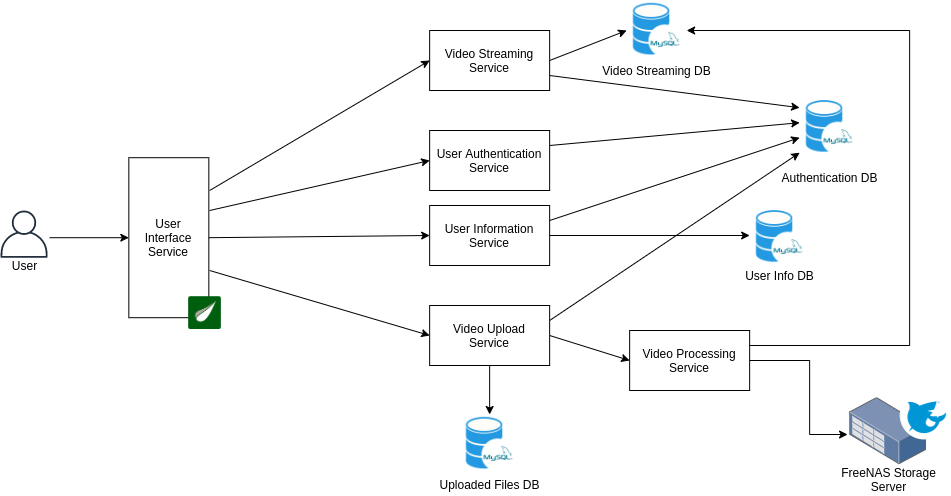

# Vidhyapak-VideoStreamingApplication
	
A fully functional scalable, reliable, secure cloud based web application is developed as part of BTech final year project. This project is developed with Spring Boot and is deployed in AWS.

The project consist of a web application in which the registered Professors can add courses and upload videos for the courses. Also the professors can add notes or other documents related to the videos. These courses can be accessed by the students by creating the student account. The application was desgned and created to deploy in our college campus (School of Engineering and Applied Science, Ahmedabad University). 

This application is made in such a way that it is scalable, reliable and secure. Microservice architecture is used in the development of the application for scalability. Following image shows the basic architecture comprising of all microservices.

### Run Application 

* To package the whole application run `package.sh` script. This will generate jars in `Services/` folder for all microservices. To run all those jars execute `run.sh` script.

* To run containers for each microservices execute `run_docker.sh` script, but before that one has to build `alpine-java` image. That can be done by pulling basic alipne image and downloading java 11 in that than saving that image. To kill all the containers execute `kill_docker.sh`.

* Also one can run `docker-compose up` in the Services directory. The docker-compose.yml file is present in Services directory. But before that one has to build the images for each microservices. The commands to build those images are given in `docker_build.txt`.

> Further find more details about the project in Report.pdf. 